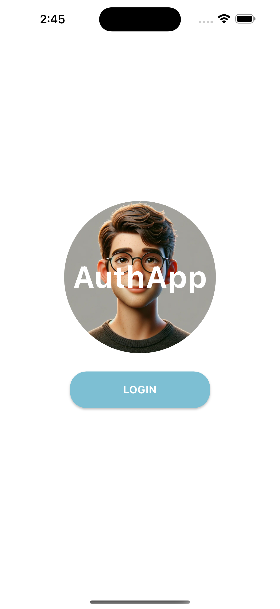

# AuthApp

AuthApp is a Flutter-based mobile application designed to provide a modern login user interface. This project includes a login page with animated transitions and a logout button.

## Features

- **Animated UI**: Smooth and engaging animations for login and home screens.
- **Responsive Design**: Adapts to different screen sizes.

## Screenshots



### Getting Started

1. **Clone the Repository**:

    ```bash
    git clone https://github.com/smexinator/auth_app.git
    ```

2. **Navigate to the Project Directory**:

    ```bash
    cd auth_app
    ```

3. **Install Dependencies**:

    ```bash
    flutter pub get
    ```

4. **Run the Application**:

    ```bash
    flutter run
    ```


## Contributing

1. **Fork the Repository**.
2. **Create a New Branch**:
    ```bash
    git checkout -b feature/your-feature
    ```
3. **Make Your Changes**.
4. **Commit Your Changes**:
    ```bash
    git add .
    git commit -m "Add your message"
    ```
5. **Push to Your Branch**:
    ```bash
    git push origin feature/your-feature
    ```
6. **Create a Pull Request**.


## Contact

For questions or feedback, please contact [durrani494@gmail.com](mailto:durrani494@gmail.com).
